# Revisão Visual da Aplicação

> **Padrão**: Lucas Engineering Standard (LES) v2.2.0  
> **Status**: Capturas reais da Central Tecnológica, Rotas SPA e Integração WhatsApp

Este documento reúne os registros visuais reais da aplicação após a **segunda passagem visual**, destacando:
- **Hero em 2 colunas na primeira dobra (Desktop)**: apresentação profissional à esquerda e o **Mapa de Sistemas Conectados** interativo à direita sem rolagem.
- **Identidade cromática enriquecida**: integração equilibrada de violeta, ciano, magenta, azul elétrico e laranja, com iluminação ambiente e contraste em dark e light mode.
- **Catálogo Modular de Projetos**: identificadores visuais `MOD-01` a `MOD-04`, bordas coloridas com glow suave temático e botões de ação diferenciados (*Explorar Estudo de Caso* vs *Prévia Rápida* com ícone `Eye`).
- **Responsividade refinada no Tablet (768px)**: breakpoint desktop elevado para `lg` (1024px) e menu compacto/gaveta ativado no tablet, eliminando esmagamento do logo "Lecino Lucas".
- **Eliminação de redundância do WhatsApp**: botão flutuante ocultado automaticamente na rota `/contato`, respeitando o bloco prioritário de atendimento.

---

## 1. Desktop (1440 × 900)

### 1.1 Página Inicial / Hero — Tema Escuro (Padrão)

### 1.2 Página Inicial / Hero — Tema Claro
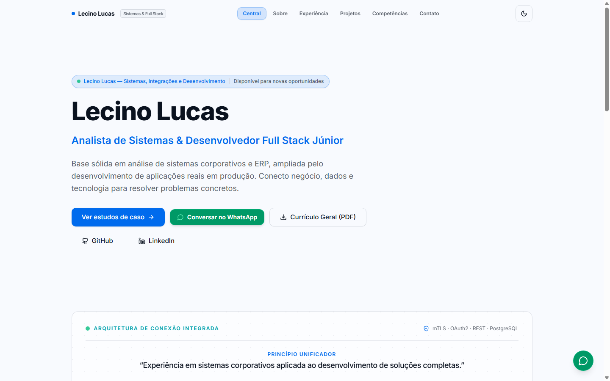

### 1.3 Seção de Projetos e Estudos de Caso

### 1.4 Detalhes do Estudo de Caso (Drawer / Modal)
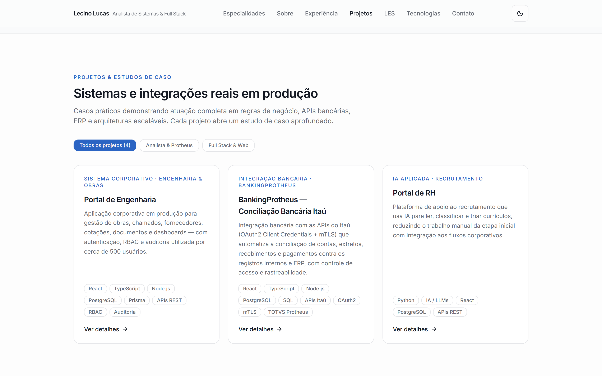

### 1.5 Formulário de Contato Direto
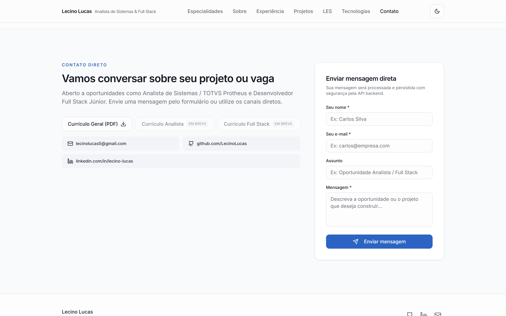

---

## 2. Tablet (768 × 1024)

### 2.1 Página Inicial / Hero
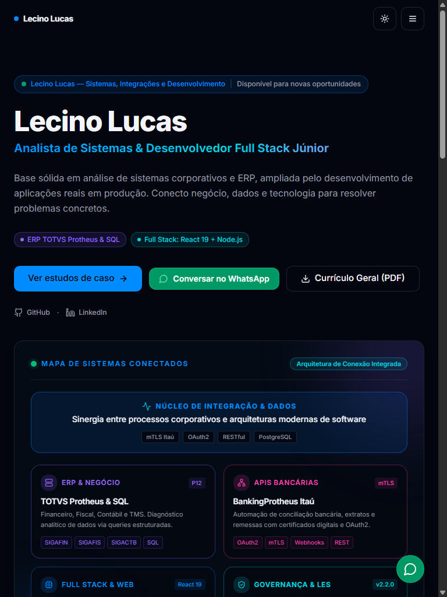

### 2.2 Seção de Projetos
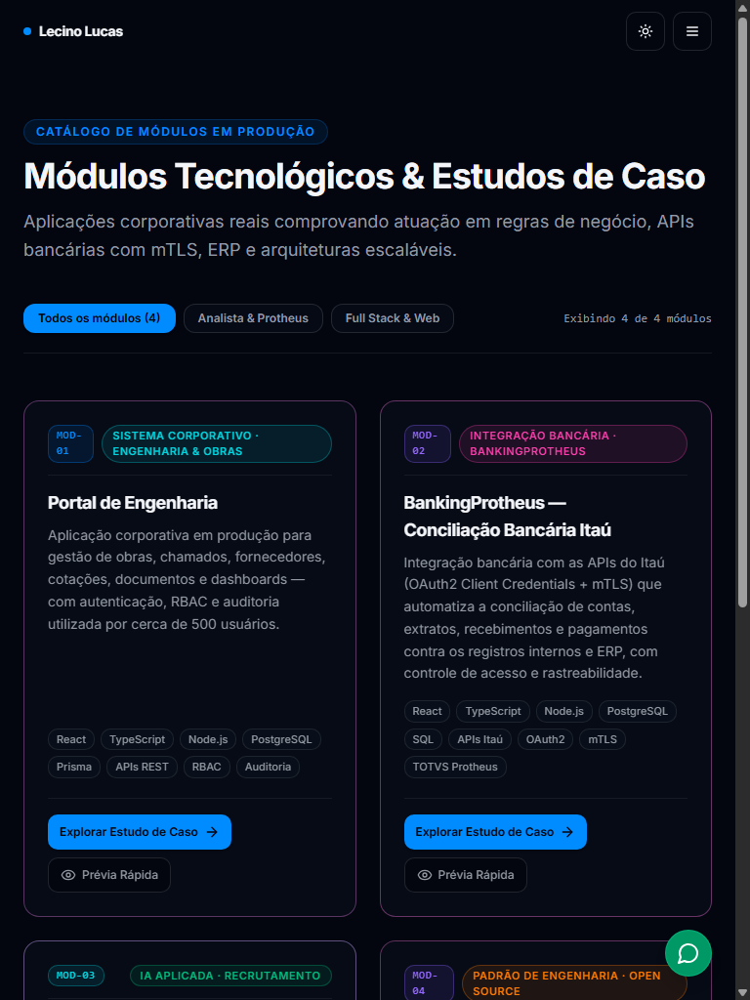

### 2.3 Formulário de Contato
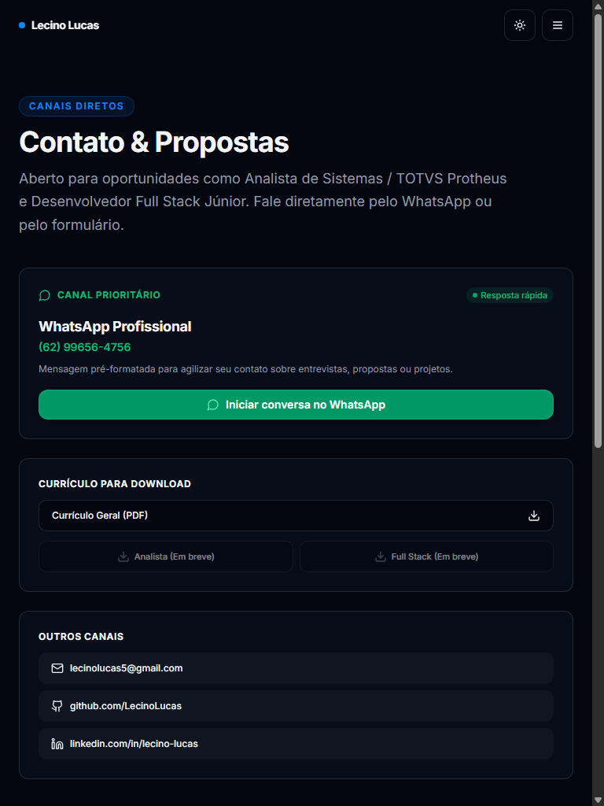

---

## 3. Mobile Real (375 × 812 — Emulado via Chrome DevTools Protocol)

> **Métricas Reais Verificadas**:  
> `window.innerWidth = 375` | `window.innerHeight = 812` | `window.devicePixelRatio = 2`  
> `document.documentElement.scrollWidth = 375` (Zero rolagem horizontal).

### 3.1 Página Inicial / Hero (Mobile Real)
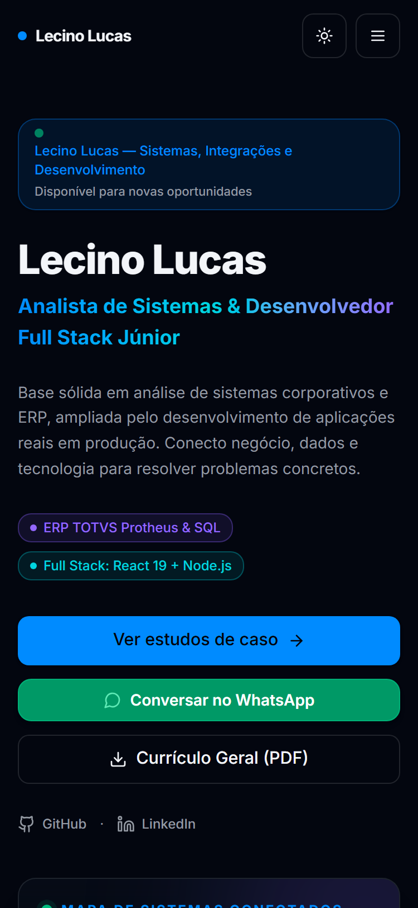

### 3.2 Menu Mobile Gaveta Aberto (85vw / Ações Roláveis)
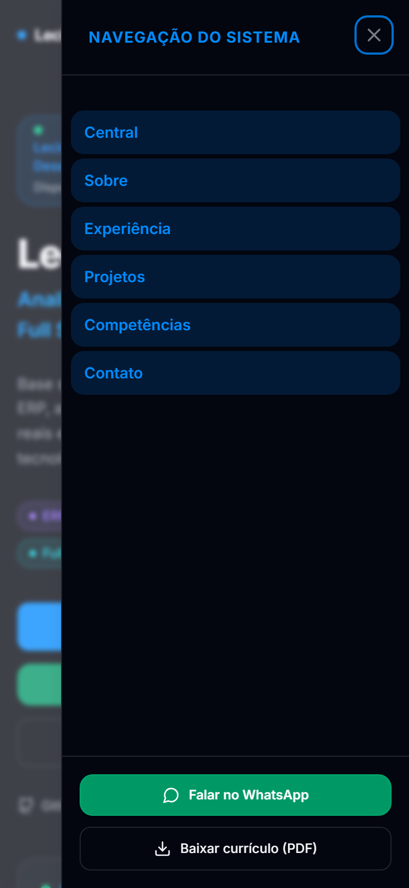

### 3.3 Catálogo de Módulos (Coluna Única / Touch Target 42px)
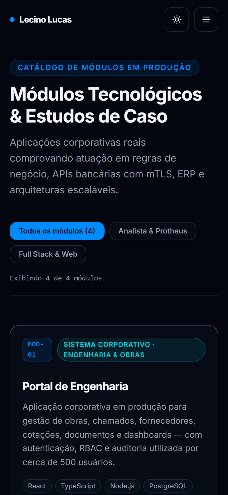

### 3.4 Formulário de Contato Direto (Sem Botão Flutuante Sobreposto)
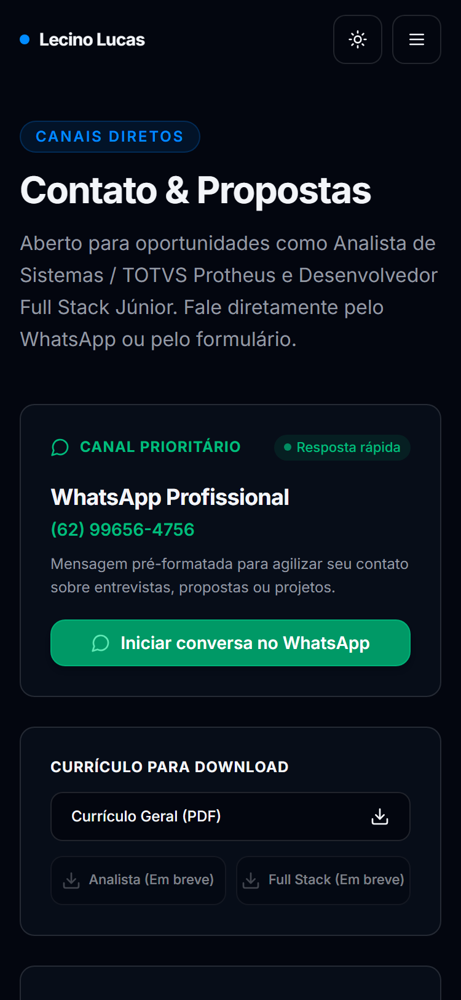

---

## 4. Demonstração Interativa Mockada — Portal RH (MOD-03)

> **Métricas Desktop (1440 × 900)**:  
> `window.innerWidth = 1440` | `window.innerHeight = 900` | `devicePixelRatio = 1`  
> `document.documentElement.scrollWidth = 1425` (Zero rolagem horizontal global).  
>
> **Métricas Mobile Real (375 × 812 — CDP Emulation)**:  
> `window.innerWidth = 375` | `window.innerHeight = 812` | `devicePixelRatio = 2`  
> `document.documentElement.scrollWidth = 375` (Zero rolagem horizontal global, viewport nativo 375px).  
>
> **Regras de Isolamento**: 100% dos dados são fictícios e locais (`portal-rh-demo-data.ts`), sem persistência de backend, com aviso permanente em banner e navegação acessível por teclado/touch/drag-and-drop.

### 4.1 Visão da Vaga — Desktop (1440 × 900)
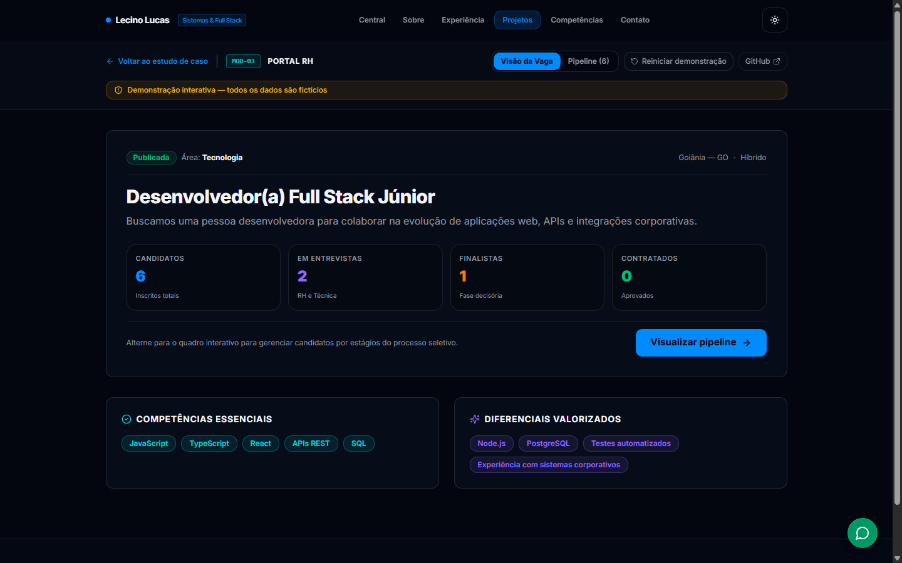

### 4.2 Pipeline de Candidatos (Kanban) — Desktop (1440 × 900)
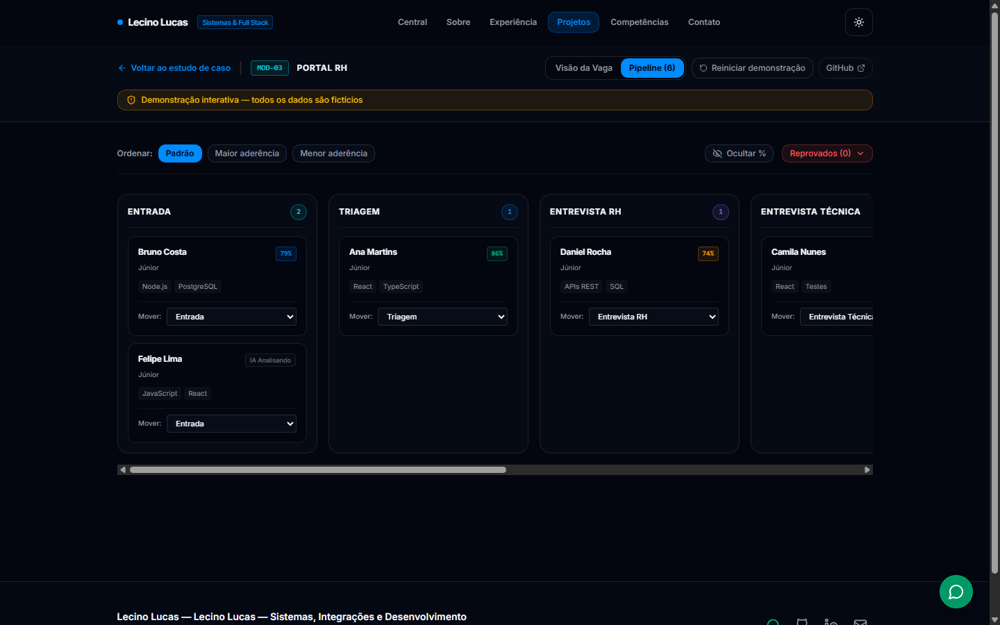

### 4.3 Visão da Vaga — Mobile Real (375 × 812)
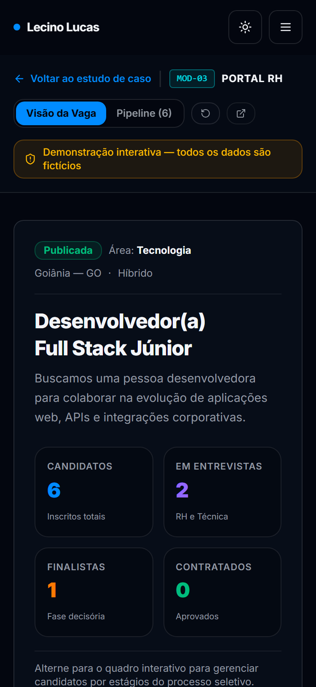

### 4.4 Pipeline de Candidatos (Kanban) — Mobile Real (375 × 812)
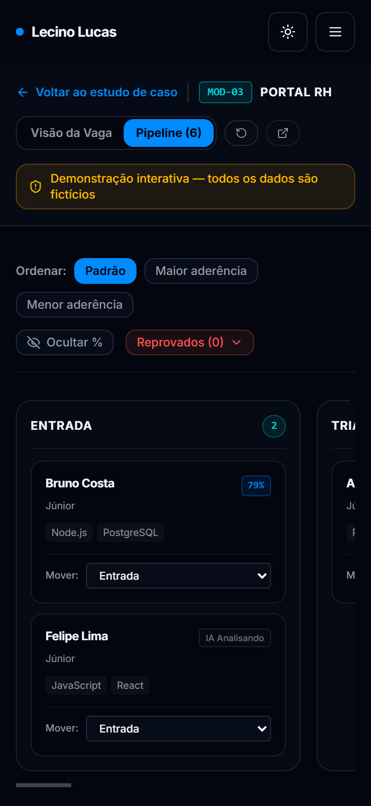

---

## 5. Demonstração Interativa Mockada — Portal de Engenharia (MOD-01)

> **Métricas Desktop (1440 × 900)**:  
> `window.innerWidth = 1440` | `window.innerHeight = 900` | `devicePixelRatio = 1`  
> `document.documentElement.scrollWidth = 1425` (Zero rolagem horizontal global).  
>
> **Métricas Mobile Real (375 × 812 — CDP Emulation)**:  
> `window.innerWidth = 375` | `window.innerHeight = 812` | `devicePixelRatio = 2`  
> `document.documentElement.scrollWidth = 375` (Zero rolagem horizontal global, viewport nativo 375px).  
>
> **Regras de Isolamento**: 100% dos dados são fictícios e matematicamente consistentes (`portal-engenharia-demo-data.ts`), sem persistência de backend, sem `localStorage`/`sessionStorage`, com aviso permanente em banner de dados fictícios, transição in-memory preservada durante a navegação entre telas e ação de "Reiniciar demonstração".

### 5.1 Painel Executivo de Obras — Desktop (1440 × 900)
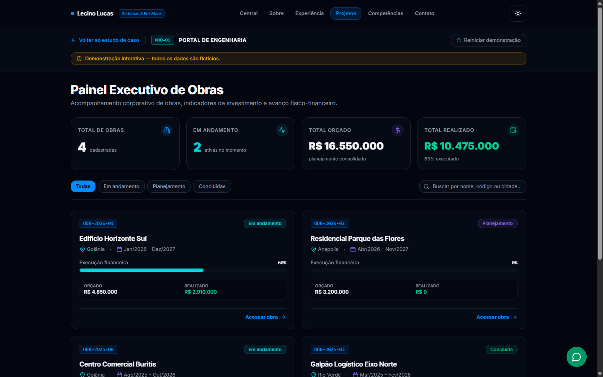

### 5.2 Detalhamento da Obra com EAP e Aprovação — Desktop (1440 × 900)
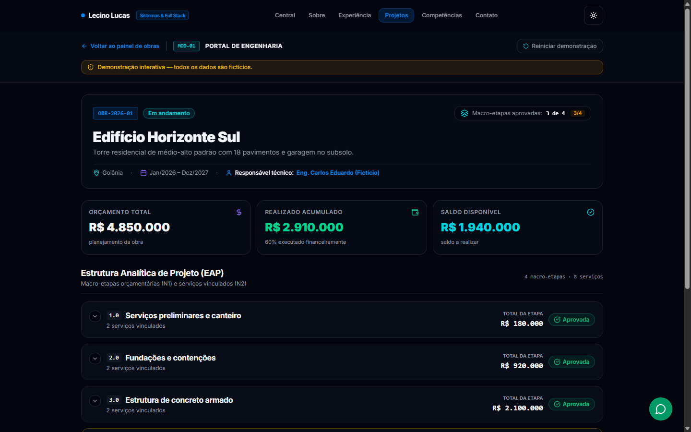

### 5.3 Painel Executivo de Obras — Mobile Real (375 × 812)
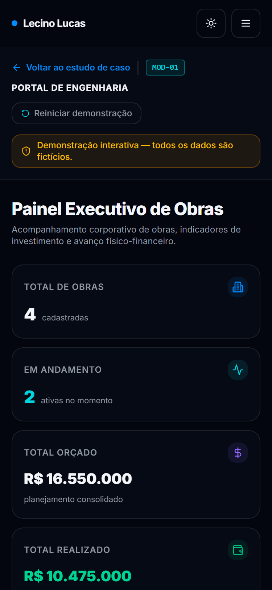

### 5.4 Detalhamento da Obra com EAP e Aprovação — Mobile Real (375 × 812)
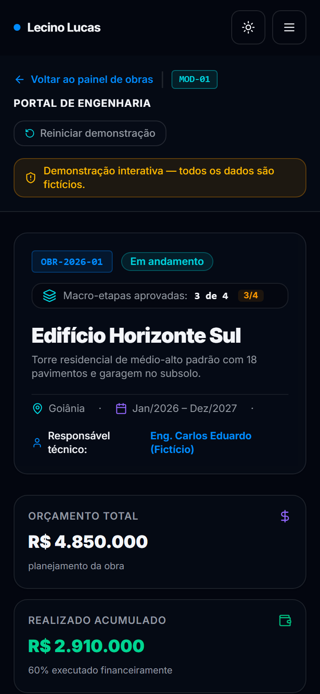

