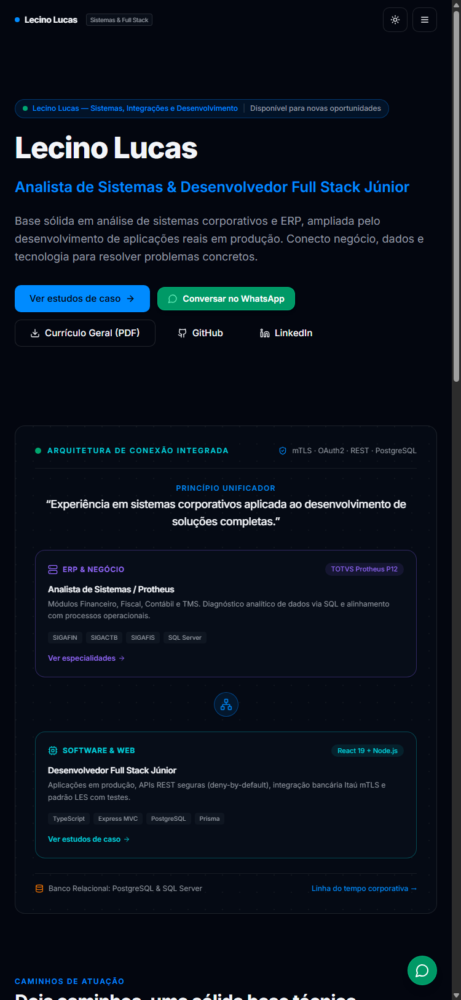
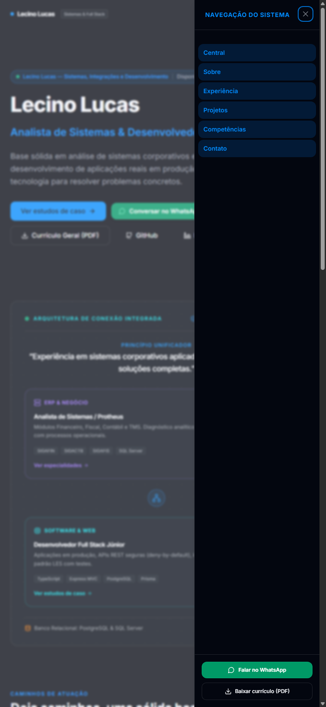
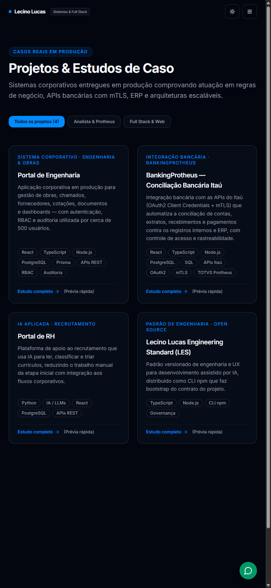
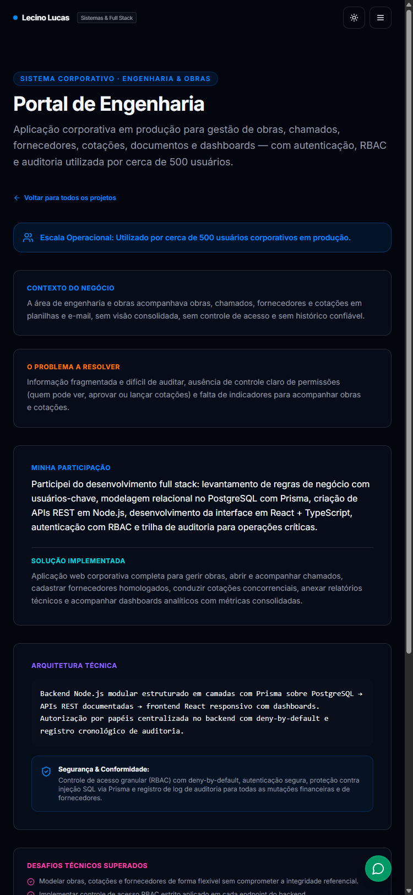
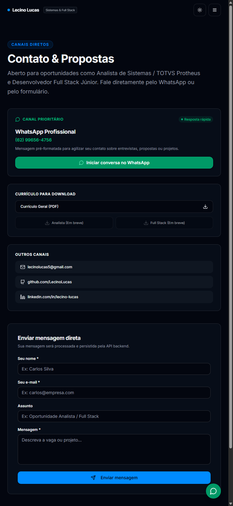

# Revisão Visual da Aplicação

> **Padrão**: Lucas Engineering Standard (LES) v2.2.0  
> **Status**: Capturas reais da Central Tecnológica, Rotas SPA e Integração WhatsApp

Este documento reúne os registros visuais reais da aplicação após a implementação da nova identidade visual tecnológica, navegação real baseada em rotas (`react-router-dom`), integração oficial com WhatsApp e design responsivo normativo (Desktop 1440×900, Tablet 768×1024 e Mobile 375×812).

---

## 1. Desktop (1440 × 900)

### 1.1 Página Inicial / Hero — Tema Escuro (Padrão)

### 1.2 Página Inicial / Hero — Tema Claro

### 1.3 Seção de Projetos e Estudos de Caso

### 1.4 Detalhes do Estudo de Caso (Drawer / Modal)

### 1.5 Formulário de Contato Direto

---

## 2. Tablet (768 × 1024)

### 2.1 Página Inicial / Hero

### 2.2 Seção de Projetos

### 2.3 Formulário de Contato

---

## 3. Mobile (375 × 812)

### 3.1 Página Inicial / Hero

### 3.2 Menu Mobile Aberto (Sheet / Radix)

### 3.3 Projetos em Cards Verticais

### 3.4 Detalhes do Projeto no Mobile

### 3.5 Formulário de Contato no Mobile

